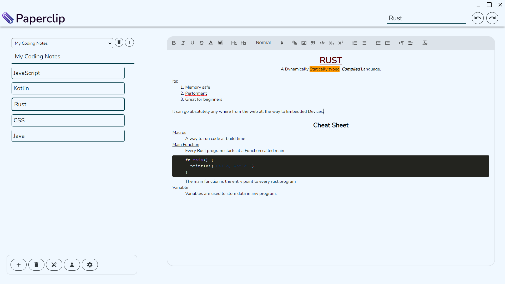

<h1 align="center">Paperclip Desktop</h1>

  
   
  

  The desktop client for the <a href="https://paper-clip.web.app">paperclip notebook</a> app.
   
  A basic electron app that allows you to use paperclip as an desktop app with a login system and offline support.

<h1 align="center">Install</h1>

  
   
  <h3 align="center">Get the latest release according to your platform <a href="https://paperclip-desktop-update-server.vercel.app/download">here</a></h3>

  Get the latest release <a href="https://paperclip-desktop-update-server.vercel.app/">here</a>, or on <a href="https://github.com/imagineeeinc/paperclip-desktop-app/releases/latest">github releases</a> for more platforms.

